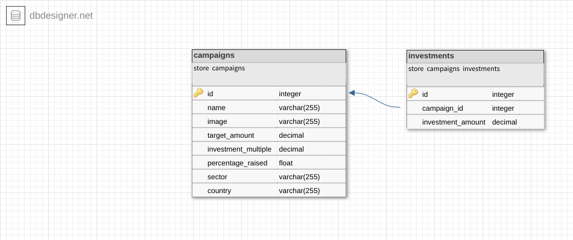

## Campaign Management Project

### Setup guidelines

#### Prerequisites:
* need to be installed [docker](https://docs.docker.com/install/) and [docker-compose](https://docs.docker.com/compose/install/) in your pc

### Clone project
1. git clone `https://github.com/ratoncse24/ror-campaign-management.git`
2. run `cd ror-campaign-management`

### Build & Run project

#### Run below command to build and run docker image
1. run: `docker-compose up`

#### Seed campaigns
1. run: `docker exec -it campaign-backend bash -c "rake db:seed"`

### Access project
* API base  url: `http://localhost:3000`


## Available API Request & Response Examples

### API Resources

- [GET /api/v1/campaigns](#get-campaigns) # This API will return list of all campaign
- [POST /api/v1/campaigns/[campaign_id]/make_investment](#post-make_investment) # This API will create new investment for a specific campaign


### GET /api/v1/campaigns

Example Campaign List: http://localhost:3000/api/v1/campaigns

Query params:

| Parameter              | Type     | Description                                            |
|:-----------------------|:---------|:-------------------------------------------------------|
| `sector`               | `string` | **Optional**. Filter campaigns by sector               |
| `country`              | `string` | **Optional**. Filter campaigns by country              |
| `number_of_investment` | `number` | **Optional**. Filter campaigns by number of investment |
| `page`                 | `number` | **Optional**. Page number                                         |
| `per_page` | `number` | **Optional**. Records per page. Default: 10 |


Response body:
```json
    {
    "data": [
        {
            "id": "1",
            "type": "campaign",
            "attributes": {
                "name": "Campaign A",
                "image": "https://www.pinterest.com/pin/221661612901629564/",
                "percentage_raised": 100.0,
                "target_amount": 500.0,
                "investment_multiple": 100.0,
                "sector": "A",
                "country": "UK"
            }
        }
        ],
        "meta": {
            "total_pages": 40,
            "total_objects": 40,
            "current_page": 1,
            "first_page": true,
            "last_page": false
        }
    }
```


### POST /api/v1/campaigns/[campaign_id]/make_investment

Example Create Investment: – POST  http://localhost:3000/api/v1/campaigns/[campaign_id]/make_investment

Request body:
```json
    { 
        "investment_amount": 200
    }
```

Response body:
```json
    
```
## Run Rspec test
1. open terminal
2. run: `docker exec -it campaign-backend bash -c "RAILS_ENV=test bundle exec rspec"`


## Database design


